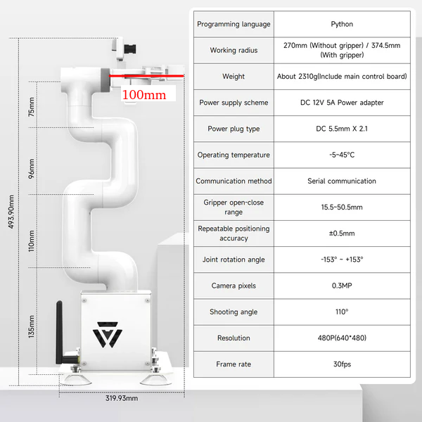

# Jetcobot-manipulation_server

## 1. 노트북 준비

`models/best.pt`, `calibration/`이 포함된 이 폴더 전체를 노트북에 둡니다.

### Ubuntu Terminal

```mkdir dl_server
cd dl_server
python3 -m venv ~/venv/dl_server
source ~/venv/dl_server/bin/activate
pip install -r requirements.txt
```

## 2. Yolo 모델 학습

`yolo_train.py`를 실행하여 yolo 모델을 학습시킵니다.

학습에 필요한 이미지들은 https://universe.roboflow.com/ 와 같은 사이트에서 다운로드 받아

`/dl_server/datasets/coco8`에

```/home/ane/dl_server/datasets/coco8
├── images
│   ├── train
│   │   ├── 000000000009.jpg
│   │   ├── 000000000025.jpg
│   │   ├── 000000000030.jpg
│   │   └── 000000000034.jpg
│   └── val
│       ├── 000000000036.jpg
│       ├── 000000000042.jpg
│       ├── 000000000049.jpg
│       └── 000000000061.jpg
├── labels
│   ├── train
│   │   ├── 000000000009.txt
│   │   ├── 000000000025.txt
│   │   ├── 000000000030.txt
│   │   └── 000000000034.txt
│   ├── train.cache
│   ├── val
│   │   ├── 000000000036.txt
│   │   ├── 000000000042.txt
│   │   ├── 000000000049.txt
│   │   └── 000000000061.txt
│   └── val.cache
├── LICENSE
└── README.md
```

이 형식으로 넣어주세요

label은 아래와 같은 형식으로
45(class 번호) 0.479492(x center 좌표, 이미지 크기에 대해서 정규화 됨) 0.688771(y center 좌표) 0.955609(width 길이) 0.5955(height 길이)
로 설정해주세요

`/dl_server/coco8.yaml`에서는

79: toothbrush 이후로

80: Charger
81: toothpaste
82: eraser

와 같은 추가 클래스를 작성해주세요

`/dl_server/yolo_train.py`에서는

model = YOLO("yolo26x.pt")  # load a pretrained model (recommended for training)
줄에서는 https://docs.ultralytics.com/tasks/detect#train 에 정의된 yolo26n.pt , yolo26s.pt, yolo26m.pt, yolo26l.pt, yolo26x.pt를 입력해주세요

results = model.train(data="/home/ane/dl_server/coco8.yaml", epochs=100, imgsz=640)
줄에서는 사용하시는 노트북의 VRAM 사양에 맞게 imgsz = 480으로 낮추시거나 

https://docs.ultralytics.com/modes/train#musgd-optimizer 의 옵션의 batch 옵션을 조정하여
results = model.train(data="/home/ane/dl_server/coco8.yaml", epochs=100, imgsz=640, batch = 8)과 같이 조정해주세요 

`/dl_server/yolo_train.py`를 통한 학습이 끝나시면 `/dl_server/runs`에 

```/home/ane/dl_server/runs
└── detect
    └── train
        └── weights
```

위와 같은 weights 폴더에 학습된 yolo 모델 가중치가 저장됩니다.

### Ubuntu Terminal

```cd dl_server
source ~/venv/dl_server/bin/activate
python3 yolo_train.py
```

1. 8000번 포트를 이용하기 때문에 8000번 포트를 이용하는 프로세스는 종료해주세요
2. `models/best.pt`가 있는지 확인해 주세요

## 3. Yolo 모델 파라미터 준비

`models/`에 download 받거나 학습한 모델 가중치를 업로드하여 `models/best.pt`가 위치하게합니다.

https://drive.google.com/file/d/1jt9kHi6C1yFN-McUetMwOg-4TwDhj613/view?usp=sharing

## 4. 딥러닝 서버 실행

`run_cilent.py`를 실행하여 Jetcobot의 이미지를 처리할 준비를 합니다.

### Ubuntu Terminal

```cd dl_server
source ~/venv/dl_server/bin/activate
python3 run_server.py
```

1. 8000번 포트를 이용하기 때문에 8000번 포트를 이용하는 프로세스는 종료해주세요
2. `models/best.pt`가 있는지 확인해 주세요

## 주요 수정 파일

- `config/server_config.ini`: YOLO MODEL 및 주요 캘리브레이션 설정
- tcp_offset_flange_to_tcp_mm = -20.0(x), -20.0(y), 100.0(z)

<p align="center">
  <br>
  <em>Jetcobot Flange to TCP 길이</em>
</p>

그림과 같이 Flange (pymycobot의 mc.get_coord()의 입력값)과 TCP(그리퍼 끝)의 길이가 100mm 이기 때문에 z = 100으로 설정

x,y는 실험을 통해 적절한 값 설정이 필요합니다.